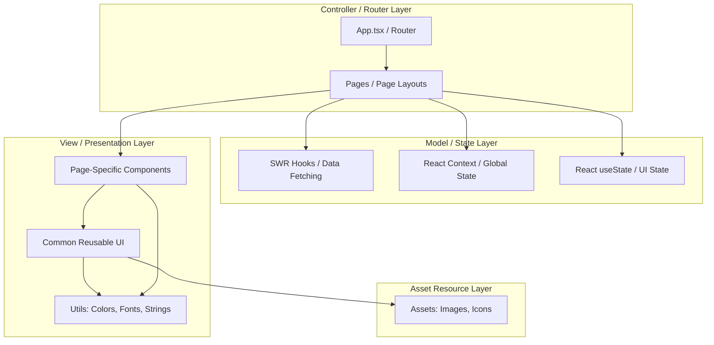

# Figma-to-Code: Fast Development Workflow for AI Agents

This guide defines the standardized workflow and folder structure for converting raw, monolithic Figma-to-code outputs into a clean, maintainable, modular, and performance-optimized React + TypeScript + Vite + Tailwind CSS codebase. It acts as an instruction manual for AI agents to rapidly structure and refactor UI design files.

---

## 🏗️ Architectural Pattern: Adaptable MVC for React

To keep the codebase scalable and clean, we map the classic **Model-View-Controller (MVC)** pattern into modern React development:



### MVC Directory Mapping:
1. **Model (Data & State)**: SWR hooks for server state (`src/hooks/useFetch.ts`), React Context for global state, and standard React state hooks for local UI logic.
2. **View (UI & Presentation)**: Reusable UI primitives (`src/components/common/`), page-specific components (`src/components/home/`, etc.), and assets/theme configurations.
3. **Controller (Orchestrators)**: Main pages (`src/pages/`) acting as coordinators that fetch data, apply layout styles, and pass data down to components; and router configuration in `src/App.tsx`.

---

## 📂 Standardized Folder Structure

When refactoring, ensure files are organized exactly in this layout:

```text
src/
├── assets/                    # Static resources
│   ├── images/                # Complex illustrations, banners, backgrounds
│   └── icons/                 # UI icons, logos, utility SVG wrappers
├── components/                # Presentation layer (Views)
│   ├── common/                # Shared/Reusable UI primitives (Buttons, Inputs, Cards)
│   │   ├── Button.tsx
│   │   ├── Card.tsx
│   │   ├── Input.tsx
│   │   └── Modal.tsx
│   ├── home/                  # Sectional components exclusive to the Home page
│   │   ├── HeroSection.tsx
│   │   ├── FeaturesSection.tsx
│   │   └── Testimonials.tsx
│   ├── blog/                  # Sectional components exclusive to the Blog page
│   │   ├── BlogCard.tsx
│   │   └── BlogList.tsx
│   └── career/                # Sectional components exclusive to the Career page
│       ├── JobCard.tsx
│       └── ApplicationForm.tsx
├── hooks/                     # Custom Hooks & SWR queries (Model layer)
│   ├── useAuth.ts
│   └── useFetchData.ts        # SWR implementations
├── layouts/                   # Shared wrapper structures
│   ├── MainLayout.tsx         # Header + Footer wrap
│   └── DashboardLayout.tsx
├── lib/                       # Third-party configurations
│   └── swr.ts                 # SWR default config
├── pages/                     # Page views / Orchestrators (Controllers)
│   ├── Home.tsx               # Orchestrates home components
│   ├── Blog.tsx
│   └── Career.tsx
├── utils/                     # Configs & static details
│   ├── constants.ts           # APIs, keys, static arrays
│   ├── colors.ts              # Theme palette constants (Tailwind equivalent hexes)
│   ├── fonts.ts               # Typography classifications (size, weight, family)
│   └── strings.ts             # All hardcoded text contents for easy translation
├── App.tsx                    # Route definitions (React Router)
├── index.css                  # Core CSS variables and Tailwind directives
└── main.tsx                   # App mounting point
```

---

## 📁 How to Dynamically Determine and Build Folder Structure

Do not assume a fixed set of pages (like `home`, `blog`, or `career`). Instead, dynamically analyze the provided raw code and construct the folder layout using the following heuristics:

### 1. Identify Pages & Routes
- Scan the source code or file names in the raw input to identify unique pages (e.g., landing page, dashboard, settings, product detail).
- Create a main orchestrator file for each under `src/pages/[PageName].tsx` (capitalized, e.g., `Home.tsx`, `Dashboard.tsx`, `Settings.tsx`).
- Define routing paths in `src/App.tsx` using `React Router` to map to these page files.

### 2. Group Page-Specific Components
- For every page identified, create a lowercase folder under `src/components/[pagename]/` (e.g., `src/components/dashboard/`, `src/components/settings/`).
- Split the page's monolithic code into separate section components (e.g., `Sidebar.tsx`, `Header.tsx`, `StatsGrid.tsx`, `SettingsForm.tsx`).
- Place these page-specific sectional components inside that folder.

### 3. Extract Common Reusable Components
- Look for visual patterns and UI controls repeated across different pages or sections (e.g., primary buttons, input fields, checkboxes, cards, dialogs).
- Extract these into `src/components/common/` (e.g., `Button.tsx`, `Input.tsx`, `Modal.tsx`).
- Parameterize them with TypeScript interfaces to accept generic props (e.g., `variant`, `size`, `isLoading`, `children`).

### 4. Locate and Export Assets Dynamically
- Extract all inline SVGs, brand logos, icons, and image placeholders from the raw Figma code.
- Save utility/interface icons (arrows, chevrons, search, edit, delete icons) as clean React components in `src/assets/icons/`.
- Save background graphics, large illustrations, and logos in `src/assets/images/`.

### 5. Parse Data & Theme Tokens
- Collect color codes (`#hex`, `rgb`) and inline styles from the raw output.
- If a style corresponds to a recurring theme element, add it as a key in `src/utils/colors.ts` or `src/utils/fonts.ts`.
- Extract all UI textual content into `src/utils/strings.ts` structured by page namespace to avoid hardcoding strings.

---

## 🔄 Step-by-Step Refactoring Workflow

Follow these steps sequentially to convert raw, monolithic code into the target structure:

### Step 1: Parse the Raw Code (`full_code.md`)
1. Analyze the raw code in `full_code.md` (or other source file).
2. Identify:
   - **Color values**: Repeated hex/RGB colors.
   - **Typography**: Font family, font sizes, weights, and letter-spacing definitions.
   - **Hardcoded Strings**: Headings, labels, placeholder texts, descriptions.
   - **SVG Assets**: Inline icons, logos.
   - **Page Segments**: Natural split points (Hero, Features, Pricing, Footers).

### Step 2: Establish Utils (Design Tokens & Text)
Create the styling and string configuration files to make code updates simple and standardized:

*   **`src/utils/colors.ts`**: Declare absolute values or semantic themes.
    ```typescript
    export const COLORS = {
      primary: {
        50: '#f0f9ff',
        500: '#0284c7',
        900: '#0c4a6e',
      },
      neutral: {
        800: '#1f2937',
        900: '#111827',
      },
      brand: '#F5A623',
    };
    ```
*   **`src/utils/fonts.ts`**: Standardize sizing/spacing patterns.
    ```typescript
    export const FONTS = {
      heading: 'font-sans tracking-tight font-bold',
      body: 'font-sans font-normal leading-relaxed',
      sizes: {
        h1: 'text-4xl md:text-5xl lg:text-6xl',
        h2: 'text-2xl md:text-3xl',
        body: 'text-base text-gray-600',
      }
    };
    ```
*   **`src/utils/strings.ts`**: Keep all textual copy in one place to allow fast changes or internationalization.
    ```typescript
    export const STRINGS = {
      home: {
        heroTitle: 'Build The Infrastructure of Tomorrow',
        heroSubtitle: 'Yamuna Infra delivers premium real estate development solutions.',
        getStartedBtn: 'Explore Projects',
      },
      common: {
        loading: 'Loading...',
        error: 'Something went wrong',
      }
    };
    ```
*   **`src/utils/constants.ts`**: Save API endpoints, select options, and static list definitions.

### Step 3: Handle Assets
1. Export SVGs from the raw code.
2. Put them in `src/assets/icons/` as clean React components or path constants.
3. Place images, illustrations, and logos in `src/assets/images/`.

### Step 4: Build Common/Reusable View Components
Identify recurring UI atoms and create reusable versions in `src/components/common/`:
- **Button**: Handles variants (solid, outline, text), loading states, and disabled states.
- **Card**: Uniform layouts, shadow states, and padding options.
- **Input / Form Elements**: Consistent border styling, active outline colors, and validation error messages.

### Step 5: Decompose Mockups Into Sectional Page Components
Split the long, raw page code into digestible pieces located under `src/components/[pageName]/`:
- Avoid pages containing thousands of lines of markup.
- A section component should be responsible for rendering one visual area (e.g., `src/components/home/HeroSection.tsx`).
- Apply the utility values (`COLORS`, `FONTS`, `STRINGS`) in place of raw text/colors inside these components.

### Step 6: Assemble Pages (Controllers)
In the corresponding page view (`src/pages/[PageName].tsx`), write the high-level layout:
- Mount sectional components in order.
- Orchestrate data loading (using SWR or React state) and pass data down to the children as props.
- Keep the page files minimal and highly readable.

### Step 7: Define Router & Main App Entry
Assemble pages into paths inside `src/App.tsx` using **React Router**:
```typescript
import { BrowserRouter, Routes, Route } from 'react-router-dom';
import Home from './pages/Home';
import Blog from './pages/Blog';
import Career from './pages/Career';
import MainLayout from './layouts/MainLayout';

function App() {
  return (
    <BrowserRouter>
      <Routes>
        <Route path="/" element={<MainLayout />}>
          <Route index element={<Home />} />
          <Route path="blog" element={<Blog />} />
          <Route path="careers" element={<Career />} />
        </Route>
      </Routes>
    </BrowserRouter>
  );
}
```


---

## ⚡ Key Rules for Fast & Clean AI Code Generation
1. **Never write inline hex colors**: Map color values to `COLORS` utility object or Tailwind theme extension.
2. **Never duplicate inline SVGs**: Extract SVGs to `/assets/icons/` or create component versions with dynamic width/height/color props.
3. **Strict separation of concerns**: Keep API endpoints and static text copy inside `utils/constants.ts` and `utils/strings.ts`. Do not hardcode them in presentation layer components.
4. **Use SWR for data management**: Avoid complex `useEffect` data fetching loops. Rely on SWR's hook-based cache validation (`useSWR(key, fetcher)`).
5. **Always make components responsive**: Rely on Tailwind classes (`sm:`, `md:`, `lg:`) to adapt layouts to mobile and desktop automatically.
